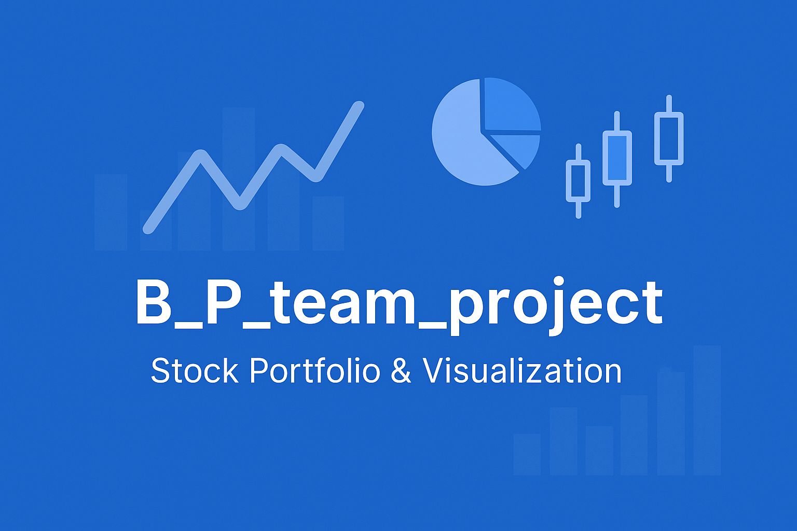

<div align="center">

# 📈 B_P_team_project  
**주식 거래 관리 · 포트폴리오 비중 설정 · 데이터 시각화 통합 솔루션**




</div>

## 🚀 주요 기능

- **회원가입 / 로그인** : 사용자별 계정 관리
- **거래 입력 & 관리** : 주식 매수/매도 내역 기록, 거래 오류 자동 감지/수정
- **포트폴리오 비중 설정** : 티커별 비율, 합계 100 초과시 경고·즉시 편집
- **CSV 자동 저장** : 각 사용자별 거래/포트폴리오 파일 분리 관리
- **데이터 시각화** : 포트폴리오·보유종목 비율, 평가금액 그래프 제공

---

## 🗂️ 폴더 구조

```
B_P_team_project/
│
├── main.py               # 메인 진입점(전체 메뉴/로직)
├── member.py             # 회원가입/로그인
├── id_stock_data.py      # 거래/포트폴리오 CSV 관리
├── stock_data.py         # 주식 입력/오류 거래 관리
├── visualize.py          # 시각화 함수
├── user_data.json        # 계정 정보
├── <user>.csv            # 거래내역
├── port_<user>.csv       # 포트폴리오 비중
├── requirements.txt      # 필요 라이브러리
└── README.md
```

---

## ⚡️ 빠른 시작

1. **설치**
```bash
git clone https://github.com/dragonbin05/B_P_team_project.git
cd B_P_team_project
pip install -r requirements.txt
```

2. **실행**

```bash
python main.py
```


## 🖥️ 사용법 & 화면 예시
*주의사항*: 가상환경을 이용하면 yfinance 라이브러리에서 종가 호출이 불가능합니다. 가상환경을 사용하지 말아주세요
1. 첫 화면 ― 회원가입 / 로그인
입력   동작
Y   ID·PW 검증 성공 시 로그인 성공
N   새 ID 선택 -> PW (특수문자 필수) 입력 -> 저장 후 자동 로그인

2. 로그인 성공 시, 메인 메뉴로 진입합니다.

===== 메인 메뉴 =====
1) 거래 내역 입력
2) 포트폴리오 비중 설정
3) 시각화
4) 종료
선택 >> 숫자를 입력하여 기능을 선택하면 됩니다.

1) 거래 내역 입력
- 티커 / 회사명 입력(영문과 특수문자만 허용)
- 실제로 거래 가능한 종목의 티커인지 확인 / 티커를 찾지 못하면 LLM을 통해 비슷한 회사명을 추천
- 최종 티커 확인 질문: Y/N 입력
- 매수/매도 선택
- 거래 데이터 한 줄 입력 예) 2010-01-01, 25.87, 10

+) 매도량이 보유량보다 많은 오류 탐색 → 목록 표시
    각 행에 대해 d 삭제 · 1 수량 수정 · 2 가격 수정 · s/Enter 건너뛰기

2) 포트폴리오 비중 설정
- 티커 입력 → 비중(숫자) 입력
- exit 입력 시 종료

+) 종목별 비중의 합이 100보다 크면 비중 재설정

3) 시각화 (서브 메뉴)
--- 시각화 ---
a) 설정 포트폴리오 비율(파이)
b) 현재 보유 종목별 원금 비중(파이)
c) 종목별 원금 vs 평가금액(꺾은선)
d) 뒤로
선택 >> a, b, c, d 중 하나를 입력하면 됩니다.

a) port_<user>.csv 존재·데이터 확인 -> 설정 포트폴리오 비율(파이그래프) 출력
b) <user>.csv 존재·데이터 확인 -> 현재 보유 종목별 원금 비중(파이그래프) 출력
c) 시각화를 원하는 종목의 티커 또는 전체(all)를 입력하세요(영어 대소문자 상관없음). (ex1)aapl, tsla / (ex2)전체 / (ex3)all
   보유 중인 종목에 대해 한 개 또는 여러 개를 합쳐서 원금과 평가금액의 그래프 출력
d) 메인 메뉴로 돌아감

4) 종료
- 프로그램을 종료

</details>

---

## 🛠️ 사용 기술

- Python 3.10+
- pandas
- matplotlib
- yfinance
- OpenAI
- 기타 표준 라이브러리
